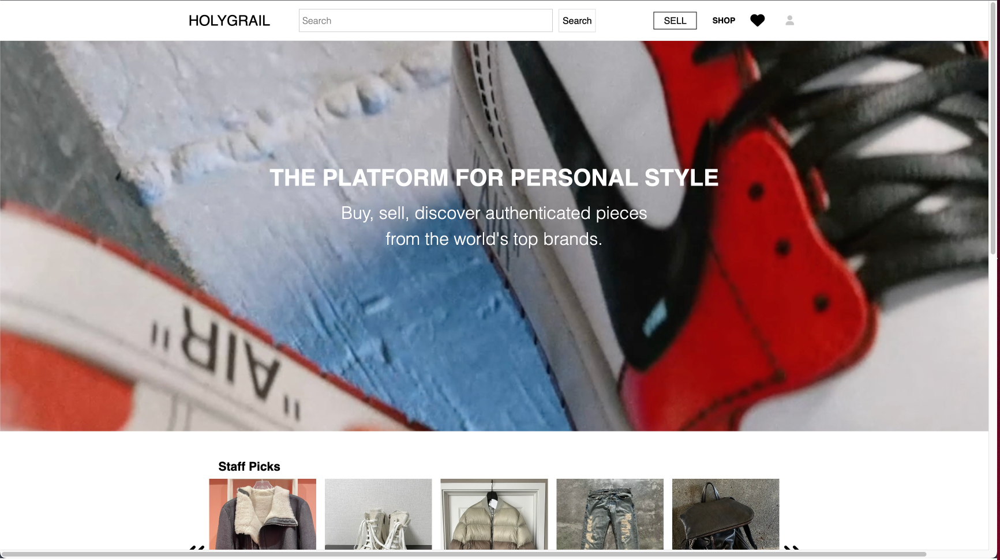
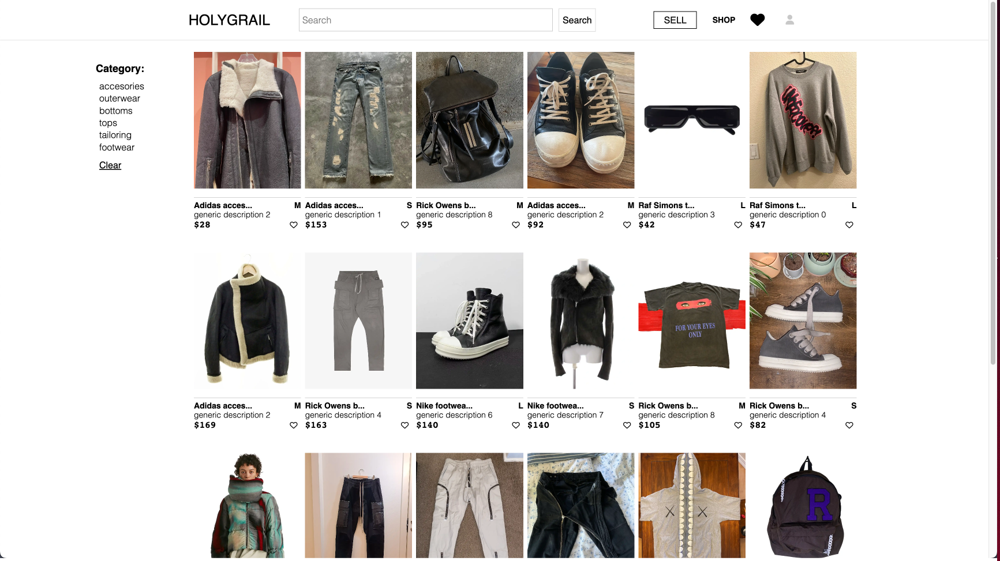
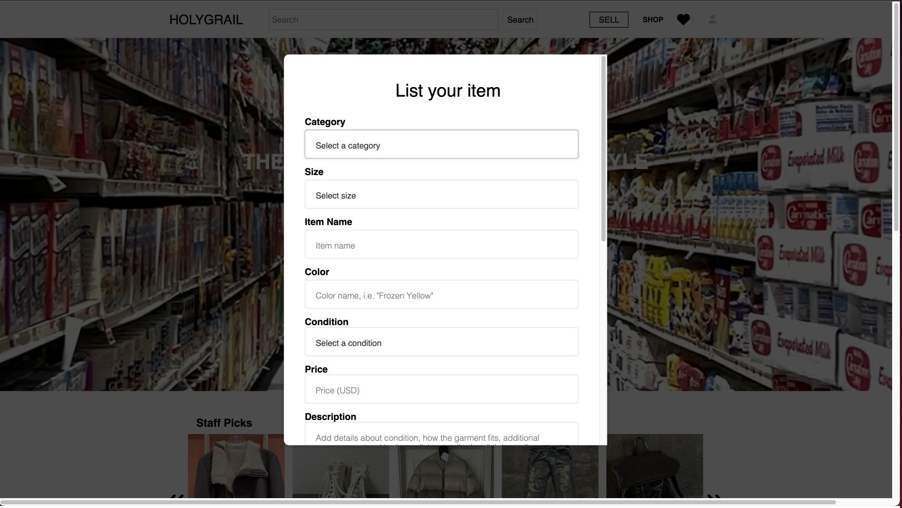

# HolyGrail

HolyGrail is a clothing website clone that resembles Grailed. HolyGrail can be used to shop high quality attire. As well as sell your own clothing. This is the perfect website for anyone looking to buy or sell authentic, luxury, vintage apparel.

## Wiki
- [Database Schema](https://github.com/SA-Ark/HolyGrail/wiki/DATABASE-SCHEMA)
- [Feature List](https://github.com/SA-Ark/HolyGrail/wiki/MVP-List)
- [User Stories](https://github.com/SA-Ark/HolyGrail/wiki/User-Stories)

## 👩‍💻 Tech Stack

**Frameworks, Platforms and Libraries:**

      

**Database:**


**Hosting:**


## 💻 Run Locally

Clone the project

### HTTPS
```bash
  git clone https://github.com/SA-Ark/HolyGrail.git
```

### SSH
```bash
  git clone git@github.com:SA-Ark/HolyGrail.git
```

Install dependencies

```bash
pip install -r requirements.txt &&
flask db upgrade &&
flask seed all
```

```bash
cd react-app
npm install --prefix react-app 
```

Start the server

```bash
pipenv run flask run
```

In seperate terminal

```bash
cd react-app
npm start
```

## Landing Page

You can access the Login Page and Signup Page from here. As well use the demo user button to explore the websites functionality while logged in.

## Home




## Items Page




## List your item




